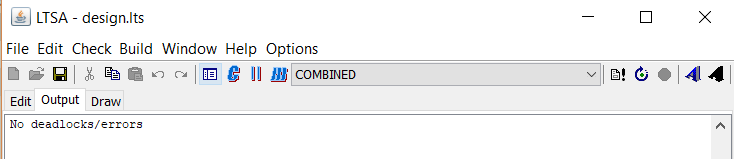
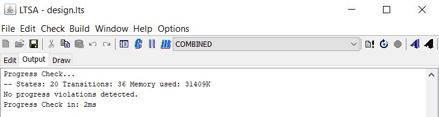
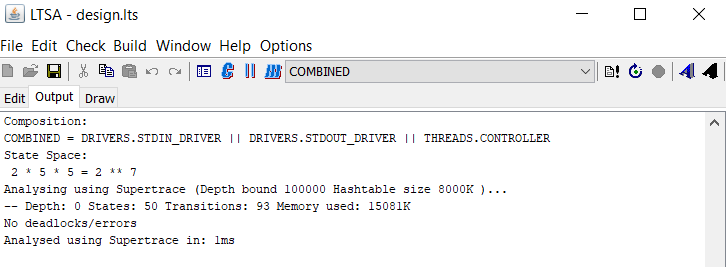

# Test

In this application different aspects will be tested.

## LTSA model

The LTSA model will using the LTSA desgin tool safety, progress and supertrace tests.

### Safety

Using the safety test of LTSA design tool the following output is produced:

### Progress

Using the progress test of LTSA design tool the following output is produced:

### Supertrace

Using the supertrace test of LTSA design tool the following output is produced:

## The minix implementation

When running the implementation on Minix it produces the following output: