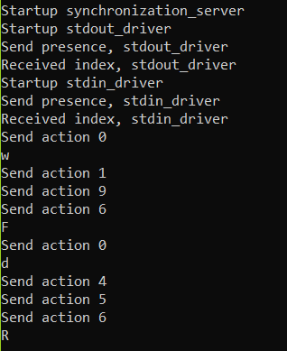

# Test

In this application different aspects will be tested.

## LTSA model

The LTSA model will using the LTSA desgin tool safety, progress and supertrace tests.

### Safety

Using the safety test of LTSA design tool the following output is produced:

### Progress

Using the progress test of LTSA design tool the following output is produced:

### Supertrace

Using the supertrace test of LTSA design tool the following output is produced:

## The minix implementation

When running the implementation on Minix it produces the following output:

Here the character 'w' and 'd' where read from the input line. This output is one of the possible traces that can be followed from the FSP model, and was tested in LTSA tools:

This concludes that the application build can follow from an FSP design, as this was the aim of this paper.