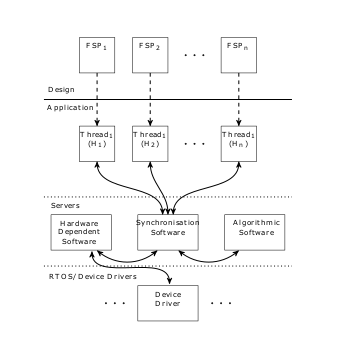

<!-- # Research -->

## What is the concurrent system architecture that will be used in this paper

This paper assumes the reader is familiar with Concurrency, LTS, LTSA and FSP.

In this paper two implementations of a finite-state machine will be used:

- Device-driver, communicate with external devices
- Thread, making decisions about the system

They both follow from a FSP design, however they differ in their way of making transitions.

When a Thread makes a transition the following steps are taken:

- Execute an action
- Changing the current state according to the FSP design
- Setting its sensitivity-list according to the FSP design and the current state

When a device-driver makes a transition the slightly differ, this is because the device-driver communicates with external devices and based upon these external devices in combination with its current state and FSP design will it determine its sensitivity-list. The steps are:

- Execute an action
- Change the current state according to the FSP design
- Setting its sensitivity-list according to the external devices, FSP design and the current state

Determining the action that will be executed by the finite-state machines is done by the synchronization-server. Based upon the sensitivity-lists and alphabets of the processes it will determine the next action that will be executed and which of the processes will execute this action.

The described elements are shown in the following diagram, this diagram represents the concurrent system architecture.

//Add reference

In the top of the diagram are the threads shown, they are represented by FSP models. At the bottom of the diagram the device-drivers are shown.

At the center of the diagram is the synchronization-server shown, it allows communication between device-drivers and threads.

The algorithmic software located on the center right is not used in this paper.